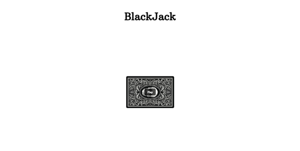
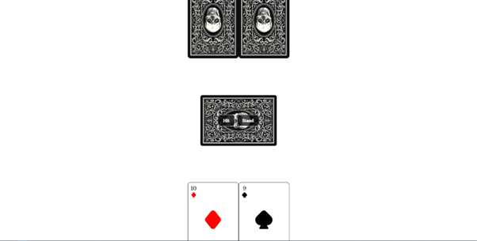
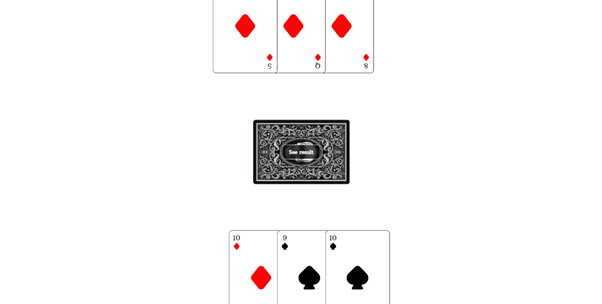
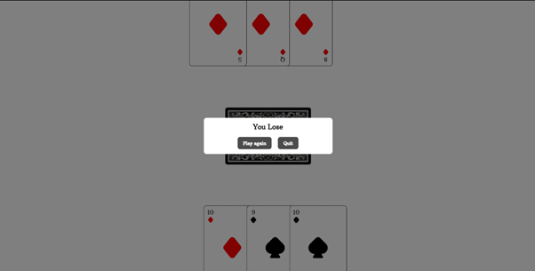

# Blackjack

  

  

  

  

## Description

A simple Vue.js based blackjack game using Vue and Vuex. The player can play blackjack agains the dealer (AI) and test his luck.

## Features

- Hit: add another card into your "hand"
- Stand: stay in the game with your current "hand"
- Show results: display your result on the screen

## Live demo

You can try out the blackjack game by visiting the [live demo](https://jpn-blackjack.netlify.app)

## How to run the app locally

If you want to run the app localy:

#### 1. Clone the repository

- HTTPS: `git clone https://github.com/Zack1808/black-jack.git`
- SSH: `git clone git@github.com:Zack1808/black-jack.git`
- GitHub CLI: `gh repo clone Zack1808/black-jack`

#### 2. Enter the project directory

`cd black-jack`

#### 3. Allow the app to install the necessary packages (Node.js has to be installed on the device)

`npm install`

#### 4. Start the app

`npm run serve`

After execution, the localhost server will startup and a browser window will open, previewing the blackjack game.

## Contribution

Contributions to the blackjack game are welcome. If you find any issues or want to add new features, feel free to create a pull request. Make sure to follow the project's coding conventions and provide detailed information about your changes.

## Contact

If you have any questions or suggestions, you can reach me via:

- Mail: jeanpierrenovak23@gmail.com
- My portfolio: [jeanpierrenovak.netlify.app](https://jeanpierrenovak.netlify.app)

---

Good luck!
